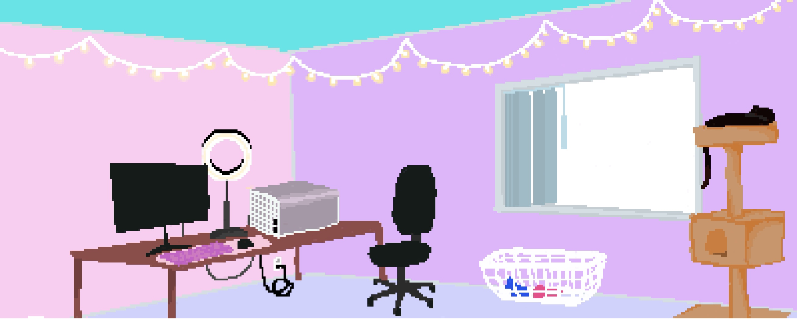

<h1 align="center">Hi 👋, I'm Lucie</h1>
<h3 align="center">I'm a future developer and developer in training!</h3>

🌱 I’m currently learning Python, Javascript, CSS, HTML.

<h3 align="center">Highlighted Repository Projects</h3>
<h4>Coder Dex</h4> 
 - search any Github Username and a Profile Card will populate: https://sasszz.github.io/coderDex/

<h4>Random Pizza Generator</h4> 
 - Clicking a button makes a pizza, original art by @sasszz: https://sasszz.github.io/randomPizzaGenerator/

<h4>Boocie's Sanctuary</h4> 
 - Custom Web Page Design with Javascript functionality: https://sasszz.github.io/boociesSanctuary/

  

<h3 align="center">Languages and Tools:</h3>

 
        

&nbsp;

