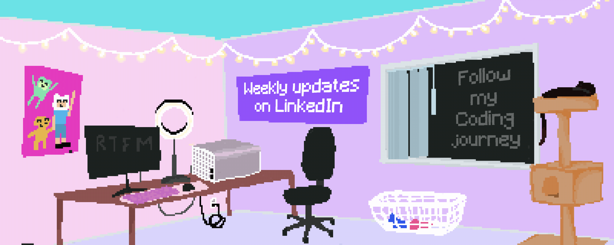
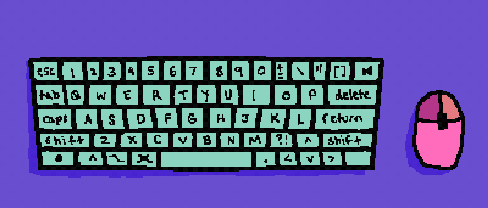
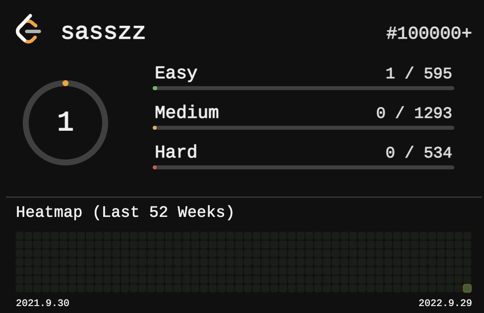

<h1 align="center">Hi 👋, I'm Lucie</h1>

 I'm a full-stack developer from California with a passion for design, front-end development, and blockchains! Check out some of my highlighted projects, as well as original art, below! 

  

<h3 align="center">🌱 Highlighted Repository Projects 🌱</h3>

<h4 align="center">Not Coinbase Wallet React App</h4> 
  
TECH STACK: React, HTML5, CSS, Bootstrap, MongoDB, Express 

  
Full-stack development - send, receive and view cryptocurrency transactions. 

  
 https://github.com/sasszz/self-custody-wallet-react-app

  
 
<h4 align="center">Gwei Check Python App</h4> 
  
TECH STACK: Python, Flask, MySQL, AWS EC2 

  
Full-stack development - live on Heroku - users can check the current cost to transact on the Ethereum Blockchain and set an email alert for low gas fees. 

  
 https://www.gweicheck.app

    
  

<h3 align="center">Follow me on GitHub and LinkedIn!</h3>

https://www.linkedin.com/in/lucie-c-sasszz</h3>

<h3 align="center">Languages and Tools:</h3>

 
        

&nbsp;

